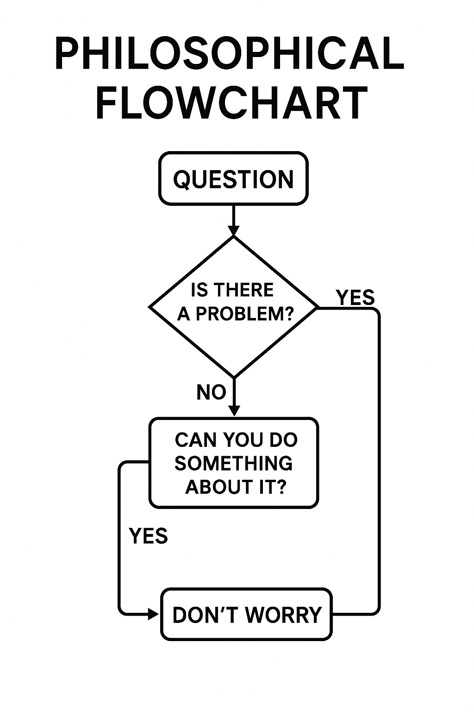

# LORI Modules

## Explore Module Axes (GitHub Pages View)

- [DGP: Demographic Gap Pressure](modules/DGP.html)
- [IOC: Immigration Offset Capacity](modules/IOC.html)
- [GHI: Genetic Hybrid Intelligence](modules/GHI.html)
- [RSS: Reproduction Strategy Simulation](modules/RSS.html)
- [RBL: Robot-Based Labor Integration](modules/RBL.html)
- [HEDA: Human–Environment Demographic Adaptation](HEDA.md)

---

## Human–Civilization Balance Radar

This radar chart visualizes the five key structural axes that support civilization continuity and adaptive coexistence:

- Demographic Gap Pressure
- Immigration Offset Capacity
- Hybrid Intelligence Potential
- Reproductive Strategy Balance
- Robot-Human Labor Integration

---

## Philosophical Flowchart Companion

This philosophical flowchart serves as a cognitive decision tool:
Should humanity intervene or allow civilization to evolve on its own?

---

## Final Reflection

This module does not end with answers, but with a mirror.

**Governance Notice:**
This repository is governed by the LORI Ethical Protocol. Any unauthorized modification or derivative use is strictly prohibited. For collaboration, please submit a formal request or Pull Request for review.

