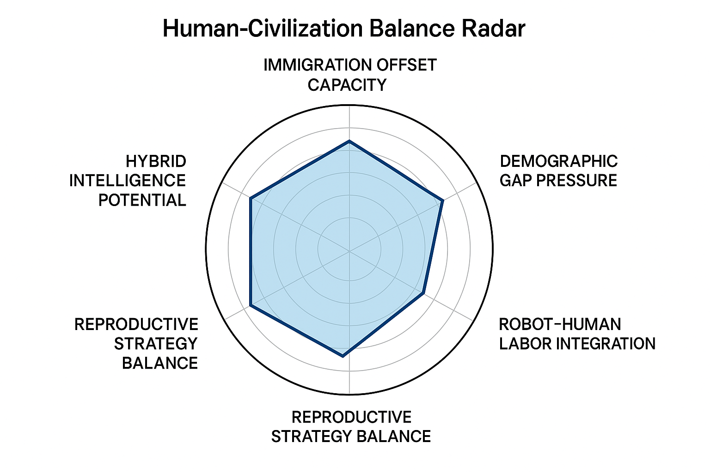

# Civilization Future Modules

**LORI-HEDA: Human-Equilibrium Demographic Architecture**

This open module explores the deep demographic fractures facing modern civilization — from aging societies to fertility collapse, and the uncertain promise of robots and artificial life to fill the void.

Rather than just modeling population, productivity, or immigration, it invites a broader, unresolved question:

> When labor is no longer needed, and intelligence is no longer human — what remains of us?

---

## Module Overview

- **DGP** – Demographic Gap Pressure  
- **IOC** – Immigration Offset Capacity  
- **GHI** – Genetic Hybrid Intelligence (Mixed Lineage Adaptability)  
- **RSS** – Reproduction Strategy Simulation  
- **RBL** – Robot-Based Labor Integration  

## Explore Module Axes

- [DGP: Demographic Gap Pressure](../modules/DGP.md)
- [IOC: Immigration Offset Capacity](../modules/IOC.md)
- [GHI: Genetic Hybrid Intelligence](../modules/GHI.md)
- [RSS: Reproduction Strategy Simulation](../modules/RSS.md)
- [RBL: Robot-Based Labor Integration](../modules/RBL.md)

---

## Human–Civilization Balance Radar

This radar chart visualizes the five key structural axes that support civilization continuity and adaptive AI-human coexistence:

- Demographic Gap Pressure
- Immigration Offset Capacity
- Hybrid Intelligence Potential
- Reproductive Strategy Balance
- Robot–Human Labor Integration

## Philosophical Flowchart Companion

This philosophical flowchart serves as a cognitive decision tool:
Should humanity intervene or allow civilization to evolve on its own?

It acts as a counterpart to the radar chart, helping guide meta-level interventions:

## Final Reflection

This module does not end with answers, but with a mirror.

### When Robots Replace Labor, and AI Surpasses Intelligence...

We measure how many humans a robot can replace.  
We model how automation can sustain an aging world.  
We simulate whether the birth rate, migration, or synthetic life can "save" us.

But—

What happens when humans are no longer needed to work,  
and are no longer the smartest beings on Earth?

**What remains of us?**

This module doesn't answer that.  
Because it shouldn't.

Some questions are not meant for models.  
They are meant to be asked.  
And remembered.

---

## Structural Consideration for Robot Deployment  
*For those who still choose to proceed.*

**1. National Demographic Structure**  
Assess aging trends, population growth/decline, and generational economic dependency.

**2. Labor Sector Distribution**  
Map current human labor by industry to identify which sectors are overburdened or at risk.

**3. Human-Centric Resource Allocation Systems**  
Consider how income, welfare, education, and social dignity will be preserved for displaced workers.

**4. Projected Productivity Ratio (Human vs Robot)**  
Establish projections of how labor will be distributed, and the thresholds at which imbalance may destabilize society.

> Robot creation is not inherently harmful—unchecked replacement is.  
> Let productivity enhance dignity, not erase it.

**Governance Notice:**
This repository is governed by the LORI Ethical Protocol. Any unauthorized modification or derivative use is strictly prohibited. For collaboration, please submit a formal request or Pull Request for review.

