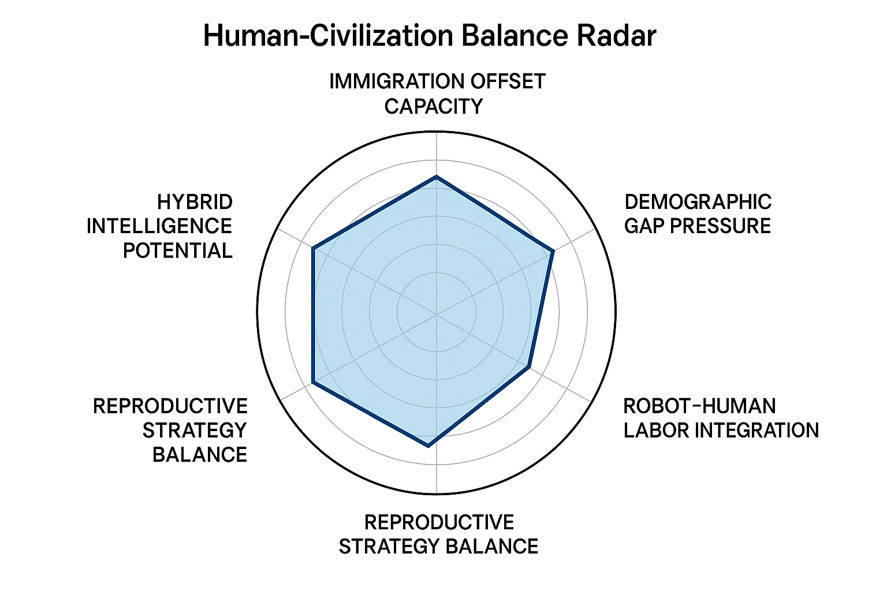

This module analyzes aging societies, fertility decline, and imbalanced generational growth as key pressures on future civilizations.

## Key Focus Areas

- **Aging Population Dynamics**
- **Youth Employment & Education**
- **Dependency Ratio and Social Burden**
- **Policy Interventions Simulation**

## Structural Model Outline

- Input: Demographic data, fertility curves, life expectancy
- Output: Risk index, adaptive pressure score

## Related Visuals

## Future Work

To be expanded with case simulations and cross-regional comparisons.
